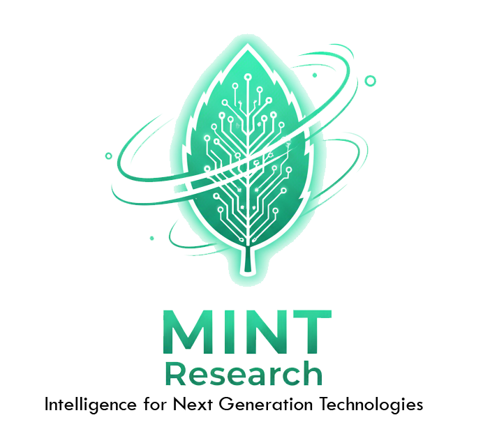

  

# MINT Research Group

### **M**INT **I**ntelligence for **N**ext-generation **T**echnologies

Welcome to the official home of the **MINT Research Group**. Based at the University of Sydney, we focus on the intersection of Machine Learning, Software Engineering, and high-impact application domains.

---

## 💡 About Us
MINT is a recursive research collective dedicated to developing "fresh" algorithmic solutions. We believe that the best technology should be like mint: crisp, essential, and refreshing. 

---

## 👋 Join Us
We are just getting started. If you are a student or researcher at USYD interested in "salt-of-the-earth" research with a "mint" finish, keep an eye on this space.

> *"The future is recursive."*

### 🎓 Student Opportunities (3rd Year Thesis / Capstone)
Are you a Software Engineering at USYD student looking for a project that balances academic rigor with real-world impact? We are looking for motivated students for 2026, and beyond.

[List of projects](https://canvas.sydney.edu.au/courses/16321/pages/thesis-topics#:~:text=Dr%20Ali%20Shakiba-,Software%20engineering,-Digital%20Twins)

Thinking of something else? Get in touch with [Ali](http://alishakiba.github.io).

---
[University of Sydney](https://www.sydney.edu.au/) | [School of Electrical and Computer Engineering](https://www.sydney.edu.au/engineering/schools/school-of-electrical-and-computer-engineering.html) | [Dr. Ali Shakiba](https://alishakiba.github.io)